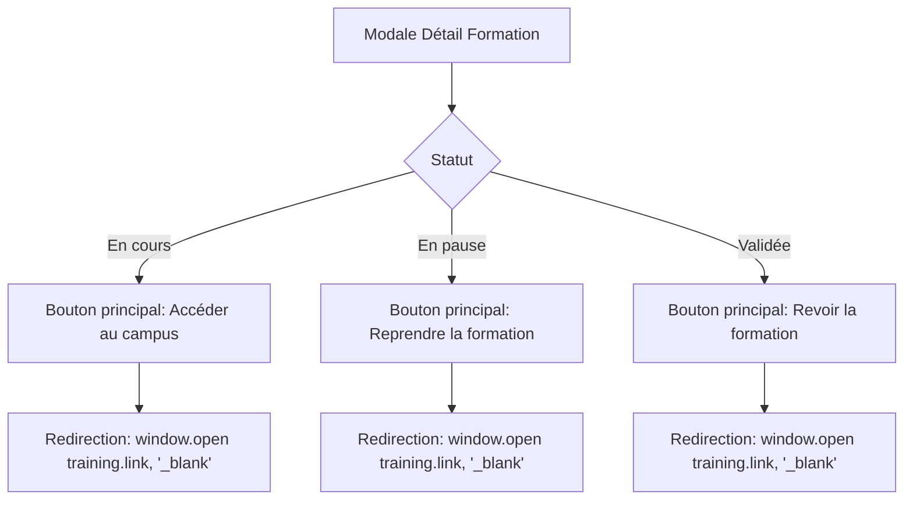

# Plan: Bouton "Reprendre la Formation" avec Redirection Campus

## Contexte

L'utilisateur souhaite améliorer l'expérience utilisateur dans l'onglet "Mes Formations" (Trainings.jsx). Actuellement, lorsqu'une formation est en cours ou validée, la modale de détail affiche des boutons pour soumettre des rapports, mais il n'y a pas de moyen direct pour l'opérateur de reprendre/reprendre la formation et être redirigé vers le campus e-learning.

## Analyse de l'Existant

### Structure actuelle des données (`src/data/mock.js`)
- Les `courses` (catalogue) ont un champ `link` pointant vers le campus
- Les `enrolledTrainings` n'ont PAS de champ `link` → il faut l'ajouter

### Boutons actuels dans la modale (Trainings.jsx)
| Statut | Bouton(s) actuel(s) |
|---------|---------------------|
| IN_PROGRESS | "Soumettre un rapport", "Demander une pause", "Déclarer terminée" |
| ON_PAUSE | "Reprendre la formation" (appel `onAction("resume")`) |
| COMPLETED | "Déposer mon certificat" |
| VALIDATED | "Évaluer la formation" |

### Problème identifié
Le bouton "Reprendre la formation" pour ON_PAUSE appelle seulement une action interne (`onAction("resume")`) mais ne redirige PAS vers le campus e-learning.

## Solution Proposée

### UI/UX - Design Senior



### Spécifications du bouton

1. **Position**: En premier dans la liste des actions (le plus visible)
2. **Style**: 
   - Couleur: Emerald (vert MINFI) - `#059669`
   - Icône: `ExternalLink` de Lucide
   - Texte: "Accéder au campus" ou "Reprendre la formation"
   - Taille: Grand, bien visible
3. **Comportement**: Ouvre le lien dans un nouvel onglet (`target="_blank"`)

### Statuts concernés
- `IN_PROGRESS` (En cours) - Formation active
- `ON_PAUSE` (En pause) - Peut reprendre
- `VALIDATED` (Validée) - Peut revoir/reprendre pour révision
- `COMPLETED` (Terminée) - Peut revoir avant validation

## Plan d'Implémentation

### Phase 1: Données (mock.js)
- [ ] Ajouter le champ `link` à chaque objet dans `enrolledTrainings`
- [ ] Utiliser les liens du catalogue courses correspondant (courseId → link)

### Phase 2: Interface (Trainings.jsx)
- [ ] Créer un composant de bouton "Campus" réutilisable
- [ ] Ajouter le bouton pour IN_PROGRESS (avant "Soumettre un rapport")
- [ ] Ajouter le bouton pour ON_PAUSE (remplacer l'ancien)
- [ ] Ajouter le bouton pour VALIDATED (après "Évaluer la formation")
- [ ] Ajouter le bouton pour COMPLETED (après "Déposer mon certificat")

### Phase 3: Tests
- [ ] Vérifier que le bouton apparaît pour chaque statut
- [ ] Vérifier que le lien s'ouvre dans un nouvel onglet
- [ ] Vérifier que les liens pointent vers les bonnes formations

## Fichiers à modifier

| Fichier | Action |
|---------|--------|
| `src/data/mock.js` | Ajouter champ `link` dans enrolledTrainings |
| `src/pages/Trainings.jsx` | Ajouter boutons de redirection campus |

## Détails techniques

### Pour le bouton "Accéder au campus":
```jsx
{training.link && (
  <a
    href={training.link}
    target="_blank"
    rel="noopener noreferrer"
    className="btn-campus"
  >
    <ExternalLink size={18} />
    {training.status === TRAINING_STATUS.VALIDATED 
      ? "Revoir la formation" 
      : "Accéder au campus"}
  </a>
)}
```

### Style CSS à ajouter:
```css
.btn-campus {
  @apply flex items-center justify-center gap-2 px-4 py-3 
         bg-emerald-500 hover:bg-emerald-600 text-white 
         font-bold rounded-xl transition-all w-full;
}
```
