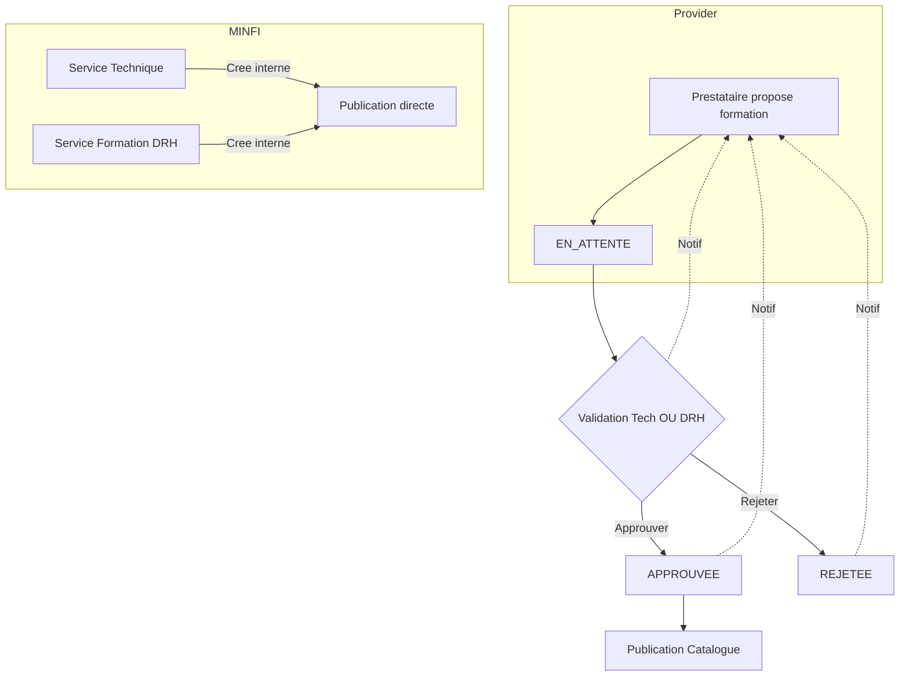

# Plan de Refonte - Gestion des Formations et Validation

## 1. Analyse des Roles Actuels et Cibles

### Roles Existants

| Role                        | Cle        | Description                   |
| --------------------------- | ---------- | ----------------------------- |
| Operateur                   | `operator` | Agent MINFI simple            |
| Chef de Service             | `manager`  | Responsable hierarchique      |
| Service Formation DRH       | `hrm`      | Gestion des formations RH     |
| Service Technique Formation | `tech`     | Support technique pedagogique |
| Administrateur Systeme      | `admin`    | Administration IT             |
| Direction / Pilotage        | `director` | Direction strategique         |

### Nouveau Role a Ajouter

| Role        | Cle        | Description                    |
| ----------- | ---------- | ------------------------------ |
| Prestataire | `provider` | Organisme de formation externe |

---

## 2. Architecture des Donnees

### 2.1 Nouveau Role PRESTATAIRE

```javascript
// src/store/index.js
export const ROLES = {
  OPERATOR: "operator",
  MANAGER: "manager",
  HRM: "hrm",
  TECH: "tech",
  ADMIN: "admin",
  DIRECTOR: "director",
  PROVIDER: "provider", // NOUVEAU
};
```

### 2.2 Donnees Prestataire Mock

```javascript
// src/store/index.js - MOCK_USERS
[ROLES.PROVIDER]: {
  id: "p1",
  name: "Cabinet Alpha Formation",
  initials: "CAF",
  role: ROLES.PROVIDER,
  department: "Organisme de Formation",
  grade: "Prestataire Agree",
  matricule: "PRV-001",
}
```

### 2.3 Liste des Prestataires (Reference)

```javascript
// src/data/mock.js
export const providers = [
  {
    id: "p1",
    name: "Cabinet Alpha Formation",
    email: "contact@alpha-formation.cm",
    phone: "+237 6XX XXX XXX",
    agrement: "N°AG/2024/001",
    specialization: "Informatique, Gestion",
    active: true,
  },
];
```

### 2.4 Structure des Demandes de Formation

```javascript
// src/data/mock.js
export const trainingRequests = [
  {
    id: "req1",
    title: "Formation Excel Avance",
    providerId: "p1",
    providerName: "Cabinet Alpha Formation",
    source: "provider", // "provider" | "internal" (MINFI)
    status: "pending", // pending | approved | rejected
    submittedAt: "2026-03-01",
    validatedBy: null,
    validatedAt: null,
    category: "transversal",
    level: "Intermediaire",
    duration: "3 jours",
    hours: 21,
    cost: 150000,
    objectives: ["Maitriser les tableaux croises dynamiques"],
    program: "Jour 1: Rappels...",
    prerequisites: "Connaissance de base Excel",
    targetAudience: "Agents des services financiers",
    location: "Yaounde - Siege MINFI",
    isOnline: false,
    maxParticipants: 20,
    certification: true,
    certificationName: "Certificat Excel Avance",
  },
];
```

---

## 3. Flux de Validation



**Regles:**

- Prestataire: Validation requise (Tech OU DRH)
- DRH/TECH: Creation directe, pas de validation

---

## 4. Specification du Formulaire

### Champs

| Champ            | Type     | Obligatoire           |
| ---------------- | -------- | --------------------- |
| titre            | text     | OUI                   |
| categorie        | select   | OUI                   |
| niveau           | select   | OUI                   |
| source           | select   | OUI (Externe/Interne) |
| prestataire      | text     | OUI                   |
| duree            | text     | OUI                   |
| heures           | text     | OUI                   |
| cout             | number   | OUI                   |
| gratuite         | checkbox | NON                   |
| lieu             | text     | OUI                   |
| enLigne          | checkbox | NON                   |
| objectifs        | textarea | OUI                   |
| programme        | textarea | OUI                   |
| prerequisites    | textarea | NON                   |
| publicCible      | text     | NON                   |
| maxParticipants  | number   | NON                   |
| certification    | checkbox | NON                   |
| nomCertification | text     | SI certification      |

---

## 5. Pages et Navigation par Role

### 5.1 PRESTATAIRE (Nouveau)

```
- Dashboard
- Proposer une formation
- Mes propositions
```

### 5.2 SERVICE FORMATION DRH

```
- Dashboard
- Catalogue
- Plan de Formation
- Planification N1
- Demandes
- Validations          <-- NOUVEAU
- Annuaire Prestataires <-- NOUVEAU
- Creer Formation      <-- NOUVEAU
- Analytiques
```

### 5.3 SERVICE TECHNIQUE

```
- Dashboard
- Catalogue
- Inscriptions LMS
- Validations           <-- NOUVEAU
- Annuaire Prestataires  <-- NOUVEAU
- Creer Formation       <-- NOUVEAU
- Statistiques Tech
```

### 5.4 DIRECTION

```
- Dashboard Strategique
- Catalogue
- Plan de Formation
- Analytiques
- Projections
- Annuaire Prestataires  <-- NOUVEAU (lecture seule)
```

---

## 6. Composants a Creer

| Fichier                                   | Description              |
| ----------------------------------------- | ------------------------ |
| `src/pages/ProviderDashboard.jsx`         | Dashboard prestataire    |
| `src/pages/Providers.jsx`                 | Annuaire prestaires      |
| `src/pages/Validations.jsx`               | Page validation DRH/TECH |
| `src/components/ui/TrainingFormModal.jsx` | Formulaire reutilisable  |

---

## 7. Plan d'Execution

1. [ ] Ajouter role PROVIDER + mock user
2. [ ] Creer liste providers dans mock.js
3. [ ] Creer trainingRequests dans mock.js
4. [ ] Mettre a jour NAV_MAP (tous roles)
5. [ ] Mettre a jour RoleSwitcher
6. [ ] Creer TrainingFormModal
7. [ ] Creer ProviderDashboard
8. [ ] Creer Providers (annuaire)
9. [ ] Creer Validations
10. [ ] Integrer routes
11. [ ] Tester flux complet
