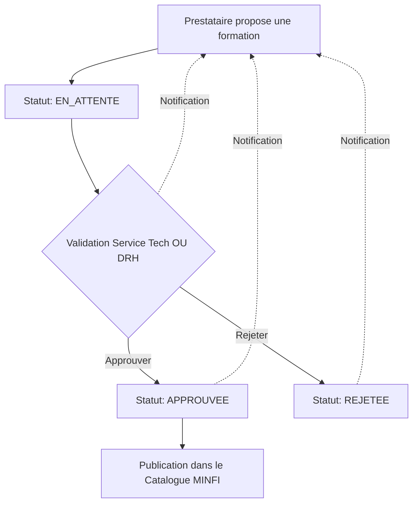

# Plan de Refonte - Gestion des Formations et Validation

## 1. Analyse des Roles Actuels et Cibles

### Roles Existants

| Role                        | Cle        | Description                   |
| --------------------------- | ---------- | ----------------------------- |
| Operateur                   | `operator` | Agent MINFI simple            |
| Chef de Service             | `manager`  | Responsable hierarchique      |
| Service Formation DRH       | `hrm`      | Gestion des formations RH     |
| Service Technique Formation | `tech`     | Support technique pedagogique |
| Administrateur Systeme      | `admin`    | Administration IT             |
| Direction / Pilotage        | `director` | Direction strategique         |

### Nouveau Role a Ajouter

| Role        | Cle        | Description                    |
| ----------- | ---------- | ------------------------------ |
| Prestataire | `provider` | Organisme de formation externe |

---

## 2. Architecture des Donnees

### 2.1 Nouveau Role PRESTATAIRE

```javascript
// src/store/index.js
export const ROLES = {
  OPERATOR: "operator",
  MANAGER: "manager",
  HRM: "hrm",
  TECH: "tech",
  ADMIN: "admin",
  DIRECTOR: "director",
  PROVIDER: "provider", // NOUVEAU
};
```

### 2.2 Donnees Prestataire Mock

```javascript
// src/store/index.js - MOCK_USERS
[ROLES.PROVIDER]: {
  id: "p1",
  name: "Cabinet Alpha Formation",
  initials: "CAF",
  role: ROLES.PROVIDER,
  department: "Organisme de Formation",
  grade: "Prestataire Agree",
  matricule: "PRV-001",
  email: "contact@alpha-formation.cm",
  phone: "+237 6XX XXX XXX",
  agrement: "N°AG/2024/001",
}
```

### 2.3 Structure des Demandes de Formation

```javascript
// src/data/mock.js
export const trainingRequests = [
  {
    id: "req1",
    title: "Formation Excel Avance",
    providerId: "p1",
    providerName: "Cabinet Alpha Formation",
    status: "pending", // pending | approved | rejected
    submittedAt: "2026-03-01",
    validatedBy: null,
    validatedAt: null,
    category: "transversal",
    level: "Intermediaire",
    duration: "3 jours",
    hours: 21,
    cost: 150000,
    objectives: [
      "Maitriser les tableaux croises dynamiques",
      "Automatiser avec les macros",
    ],
    program: "Jour 1: Rappels... \nJour 2: TCD... \nJour 3: Macros...",
    prerequisites: "Connaissance de base Excel",
    targetAudience: "Agents des services financiers",
    location: "Yaounde - Siège MINFI",
    isOnline: false,
    maxParticipants: 20,
    certification: true,
    certificationName: "Certificat de competence Excel Avance",
  },
];
```

---

## 3. Flux de Validation



---

## 4. Specification du Formulaire de Creation

### 4.1 Champs du Formulaire (Prestataire)

| Champ            | Type     | Obligatoire  | Description                                       |
| ---------------- | -------- | ------------ | ------------------------------------------------- |
| titre            | text     | OUI          | Intitule de la formation                          |
| categorie        | select   | OUI          | job/transversal/specific/executive                |
| niveau           | select   | OUI          | Debutant/Intermediaire/Avance/Expert/Tous niveaux |
| prestataire      | text     | OUI          | Nom de l'organisme (auto-rempli)                  |
| duree            | text     | OUI          | Ex: "3 jours"                                     |
| heures           | text     | OUI          | Ex: "21h"                                         |
| cout             | number   | OUI          | Cout unitaire en FCF                              |
| gratuite         | checkbox | NON          | Formation gratuite ou payante                     |
| lieu             | text     | OUI          | Lieu physique                                     |
| enLigne          | checkbox | NON          | Formation disponible en ligne                     |
| objectifs        | textarea | OUI          | Objectifs pedagogiques                            |
| programme        | textarea | OUI          | Deroule detaille jour par jour                    |
| prerequisites    | textarea | NON          | Prerequisites requis                              |
| publicCible      | text     | NON          | Service ou categorie cible                        |
| maxParticipants  | number   | NON          | Nombre maximum de participants                    |
| certification    | checkbox | NON          | Delivrance d'une certification                    |
| nomCertification | text     | CONDITIONNEL | Nom de la certification si Oui                    |
| contactEmail     | email    | OUI          | Email du prestataire                              |
| contactPhone     | tel      | NON          | Telephone du prestataire                          |

### 4.2 UI du Formulaire

- Modal avec scroll si necessaire
- Groupement des champs par sections:
  - **Informations Generales**: titre, categorie, niveau
  - **Details**: duree, heures, cout, gratuite
  - **Lieu**: lieu, enLigne
  - **Contenu Pedagogique**: objectifs, programme, prerequisites, publicCible
  - **Logistique**: maxParticipants
  - **Certification**: certification, nomCertification
  - **Contact**: contactEmail, contactPhone

---

## 5. Page Prestataire - Dashboard

### 5.1 Navigation pour Prestataire

```
- Dashboard (stats)
- Proposer une formation
- Mes formations proposees
- Historique des validations
```

### 5.2 Composants du Dashboard

#### 5.2.1 Statistiques

- Nombre de formations proposees
- En attente de validation
- Approuvees
- Rejetees

#### 5.2.2 Liste des Formations Proposees

| Colonne         | Description                      |
| --------------- | -------------------------------- |
| Titre           | Intitule de la formation         |
| Date soumission | Date de soumission               |
| Statut          | En attente / Approuvee / Rejetee |
| Actions         | Voir / Modifier / Supprimer      |

#### 5.2.3 Formulaire de Proposition

- Bouton "Proposer une formation" ouvrant le modal

---

## 6. Page de Validation (DRH / TECH)

### 6.1 Navigation Supplementaire

- **Service Formation DRH** et **Service Technique Formation**:
  - Nouvelle entree: "Validations" ou "Demandes de publication"
  - Acces depuis le menu principal

### 6.2 Liste des Demandes en Attente

| Colonne         | Description                        |
| --------------- | ---------------------------------- |
| Titre           | Intitule de la formation           |
| Prestataire     | Nom de l'organisme                 |
| Date soumission | Date de soumission                 |
| Cout            | Cout unitaire                      |
| Actions         | Voir details / Approuver / Rejeter |

### 6.3 Detail de la Demande

- Affichage complet de toutes les informations
- Zone de commentaire pour le validateur
- Boutons: Approuver / Rejeter

---

## 7. Mises a Jour Necessaires

### 7.1 Fichiers a Modifier

| Fichier                              | Modification                                                  |
| ------------------------------------ | ------------------------------------------------------------- |
| `src/store/index.js`                 | Ajouter role PROVIDER et mock user                            |
| `src/components/layout/AppShell.jsx` | Ajouter navigation pour PROVIDER, TECH, HRM                   |
| `src/components/ui/RoleSwitcher.jsx` | Ajouter option PROVIDER                                       |
| `src/data/mock.js`                   | Ajouter trainingRequests, mettre a jour catalogue avec status |
| `src/i18n/index.js`                  | Ajouter traductions pour les nouveaux textes                  |
| `src/App.jsx`                        | Ajouter routes pour nouvelles pages                           |

### 7.2 Composants a Creer

| Composant                                 | Description                                     |
| ----------------------------------------- | ----------------------------------------------- |
| `src/pages/ProviderDashboard.jsx`         | Page principale du prestataire                  |
| `src/pages/ProviderPropose.jsx`           | Formulaire de proposition                       |
| `src/pages/Validations.jsx`               | Page de validation pour DRH/TECH                |
| `src/components/ui/TrainingFormModal.jsx` | Composant modal reutilisable pour le formulaire |

---

## 8. Notifications

### 8.1 Types de Notifications

| Evenement           | Destinataires | Message                                      |
| ------------------- | ------------- | -------------------------------------------- |
| Nouvelle soumission | TECH, HRM     | "Nouvelle demande de publication en attente" |
| Formation approuvee | PROVIDER      | "Votre formation a ete approuvee et publiee" |
| Formation rejetee   | PROVIDER      | "Votre formation a ete rejetee. Motif: ..."  |

### 8.2 Implementation

- Ajouter dans le store `notifications` existente
- Creer une fonction `addTrainingNotification(type, data)`

---

## 9. Plan d'Execution (Ordre Prioritaire)

### Etape 1: Infrastructure (Fondations)

- [ ] Ajouter le role PROVIDER dans store/index.js
- [ ] Ajouter les donnees mock pour les utilisateurs prestataires
- [ ] Ajouter les traductions de base

### Etape 2: Navigation

- [ ] Mettre a jour NAV_MAP pour PROVIDER
- [ ] Mettre a jour NAV_MAP pour HRM (ajouter Validations)
- [ ] Mettre a jour NAV_MAP pour TECH (ajouter Validations)
- [ ] Mettre a jour RoleSwitcher

### 3. Donnees et Modeles

- [ ] Creer la structure trainingRequests dans mock.js
- [ ] Ajouter des donnees de test (demandes en attente, approuvees, rejetees)

### 4. Composants UI

- [ ] Creer TrainingFormModal (formulaire reutilisable)
- [ ] Creer ProviderDashboard (page principale prestataire)
- [ ] Creer Validations (page de validation DRH/TECH)

### 5. Integration et Tests

- [ ] Integrer les routes dans App.jsx
- [ ] Tester le flux complet: soumission -> validation -> publication
- [ ] Verifier les notifications

---

## 10. Consideration Techniques

### 10.1 Gestion des IDs

- Generation automatique avec: `req-${Date.now()}`
- Format: `req-1709XXX`

### 10.2 Persistance (Simulation)

- Les modifications sont stockees en memoire (state React)
- Pour demo: utiliser localStorage ou zustand persist

### 10.3 Validation des Champs

- Tous les champs obligatoires doivent etre valides
- Affichage des erreurs en rouge sous les champs
- Desactivation du bouton si formulaire invalide
