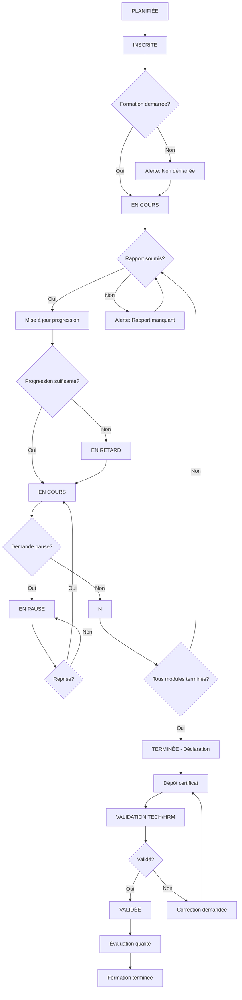

# Plan d'Implémentation - Domaine E : Suivi des Formations

## Analyse du Contexte Actuel

### Structure Existante

| Composant                                                                     | État        | Description                                               |
| ----------------------------------------------------------------------------- | ----------- | --------------------------------------------------------- |
| [`src/data/mock.js`](src/data/mock.js:377)                                    | ✅ Existant | `myTrainings` avec status (inProgress, paused, validated) |
| [`src/pages/Trainings.jsx`](src/pages/Trainings.jsx:1)                        | ✅ Existant | Page de suivi basique avec progression                    |
| [`src/store/index.js`](src/store/index.js:1)                                  | ✅ Existant | ROLES, notifications, état global                         |
| [`src/components/layout/AppShell.jsx`](src/components/layout/AppShell.jsx:35) | ✅ Existant | Navigation par rôle                                       |

### États Existants vs RequIS

| État Actuel  | État Workflow Requis     |
| ------------ | ------------------------ |
| `inProgress` | `EN COURS`               |
| `paused`     | `EN PAUSE`               |
| `validated`  | `VALIDÉE`                |
| `planned`    | `PLANIFIÉE` / `INSCRITE` |
| ❌ Manquant  | `EN RETARD`              |
| ❌ Manquant  | `TERMINÉE (DÉCLARÉE)`    |

---

## Architecture des Données

### Nouveau Modèle de Données (mock.js)

```javascript
// Statuts de formation
const TRAINING_STATUS = {
  PLANNED: "planifiee",      // Planifiée
  REGISTERED: "inscrite",    // Inscrite
  IN_PROGRESS: "enCours",    // En cours
  ON_PAUSE: "enPause",       // En pause
  DELAYED: "enRetard",       // En retard
  COMPLETED: "terminee",      // Terminée (déclarée)
  VALIDATED: "validee",      // Validée
  REJECTED: "rejetee"        // Rejetée
};

// Entité Formation Suivie
{
  id: String,
  employeeId: String,
  courseId: String,
  title: String,
  provider: String,
  status: TRAINING_STATUS,

  // Dates
  registrationDate: Date,
  startDate: Date,
  expectedEndDate: Date,
  actualEndDate: Date,

  // Progression
  progress: Number (0-100),
  modulesCompleted: Number,
  totalModules: Number,

  // Rapports de suivi
  reports: [{
    id: String,
    date: Date,
    modulesStudied: String[],
    timeSpent: Number, // heures
    difficulties: String,
    comments: String,
    progress: Number
  }],

  // Pause
  pauses: [{
    id: String,
    startDate: Date,
    endDate: Date,
    reason: String,
    approved: Boolean
  }],

  // Émargement
  attendances: [{
    date: Date,
    startTime: String,
    endTime: String,
    signedByLearner: Boolean,
    signedByTrainer: Boolean
  }],

  // Documents
  certificate: {
    url: String,
    uploadDate: Date,
    verified: Boolean
  },
  attestation: {
    url: String,
    uploadDate: Date
  },

  // Évaluation
  evaluation: {
    date: Date,
    contentQuality: Number (1-5),
    trainerQuality: Number (1-5),
    relevance: Number (1-5),
    satisfaction: Number (1-5),
    comments: String
  },

  // Audit
  createdAt: Date,
  updatedAt: Date,
  history: [{
    date: Date,
    action: String,
    user: String,
    details: String
  }]
}
```

---

## Plan d'Implémentation

### Phase 1 : Structure de Données (mock.js)

- [ ] **1.1** Créer les constantes de statuts dans mock.js
- [ ] **1.2** Créer un nouveau tableau `enrolledTrainings` avec la structure complète
- [ ] **1.3** Ajouter des données de test réalistes (5-10 formations avec différents statuts)
- [ ] **1.4** Ajouter les structures `trainingReports`, `pauses`, `attendances`, `certificates`

### Phase 2 : Extension du Store (store/index.js)

- [ ] **2.1** Ajouter les fonctions de gestion des formations suivies
- [ ] **2.2** Créer les actions : `startTraining`, `submitReport`, `requestPause`, `endTraining`, `validateTraining`
- [ ] **2.3** Ajouter le système d'alertes dans les notifications
- [ ] **2.4** Configurer la persistance

### Phase 3 : Page Suivi des Formations (Trainings.jsx)

- [ ] **3.1** Refondre la page avec les nouveaux statuts
- [ ] **3.2** Ajouter les onglets : "Mes formations", "Suivi équipe" (pour managers)
- [ ] **3.3** Implémenter l'affichage de la progression détaillée
- [ ] **3.4** Ajouter les filtres par statut
- [ ] **3.5** Intégrer les liens vers le campus

### Phase 4 : Modales de Gestion

#### 4.1 Modale de Rapport de Suivi

- [ ] Formulaire de rapport périodique
- [ ] Champs : modules étudiés, temps passé, difficultés, commentaires
- [ ] Calcul automatique de la progression

#### 4.2 Modale de Demande de Pause

- [ ] Formulaire de pause avec motif et durée
- [ ] Contrôle : max 3 pauses par formation
- [ ] Workflow d'approbation

#### 4.3 Modale d'Émargement (Présentiel)

- [ ] Formulaire de signature numérique
- [ ] Validation par l'apprenant et le formateur

#### 4.4 Modale de Clôture

- [ ] Dépôt de certificat/attestation
- [ ] Déclaration de fin de formation

#### 4.5 Modale de Validation (pour TECH/HRM)

- [ ] Vérification des documents
- [ ] Approbation ou rejet avec motif

### Phase 5 : Système d'Alertes

- [ ] **5.1** Alerte : Rapport non soumis dans les délais
- [ ] **5.2** Alerte : Progression insuffisante
- [ ] **5.3** Alerte : Formation non commencée
- [ ] **5.4** Alerte : Certificat manquant après fin de formation

### Phase 6 : Évaluation Post-Formation

- [ ] **6.1** Questionnaire qualité après validation
- [ ] **6.2** Critères : qualité contenu, formateur, pertinence, satisfaction
- [ ] **6.3** Calcul du score pour les prestataires

### Phase 7 : Navigation

- [ ] **7.1** Ajouter une nouvelle entrée "Suivi" dans NAV_MAP pour OPERATOR
- [ ] **7.2** Mettre à jour les traductions (i18n)

---

## Diagramme de Flux



---

## Interfaces Requises

### 1. Dashboard Apprenant

- Formations en cours
- Progression
- Prochain rapport à remplir
- Alertes actives

### 2. Page Suivi Formation

- Progression par modules
- Rapports soumis
- Pause demandée
- Documents déposés

### 3. Dashboard Technique (TECH/HRM)

- Formations en cours
- Rapports manquants
- Certificats à valider
- Formations à clôturer

---

## Livrables

| Livrable                  | Priorité   | Complexité |
| ------------------------- | ---------- | ---------- |
| Structure données mock.js | 🔴 Haute   | Faible     |
| Extension store           | 🔴 Haute   | Moyenne    |
| Page Trainings refondue   | 🔴 Haute   | Haute      |
| Modale rapport            | 🟡 Moyenne | Moyenne    |
| Modale pause              | 🟡 Moyenne | Faible     |
| Modale émargement         | 🟡 Moyenne | Moyenne    |
| Modale validation         | 🟡 Moyenne | Faible     |
| Système d'alertes         | 🟢 Basse   | Haute      |
| Évaluation post-formation | 🟢 Basse   | Moyenne    |

---

## Notes Techniques

1. **État local vs global** : Les formations suivies doivent être dans le store global pour la persistance
2. **Calculs automatiques** : La date de fin estimée doit se recalculer automatiquement en cas de pause
3. **Validation** : Le workflow de validation nécessite des rôles spécifiques (TECH, HRM)
4. **Audit** : Chaque action doit être enregistrée dans l'historique pour la traçabilité
